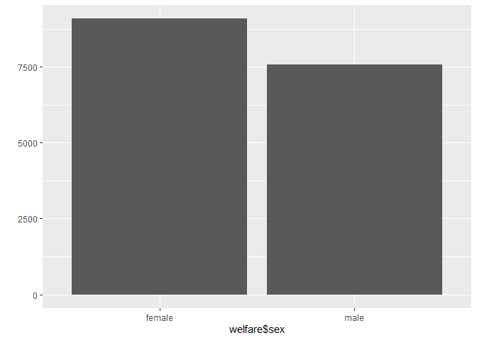
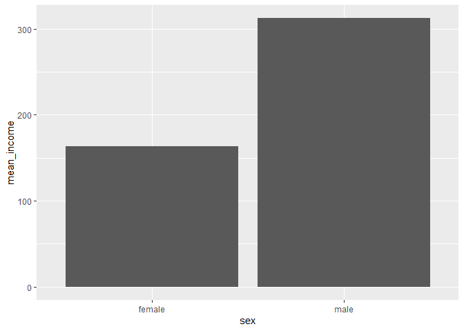

성별에 따른 월급 차이
================
정현진
July 30, 2020

## 2\. 성별에 따른 월급 차이

### 분석 절차

성별과 월급 두 변소를 검토 후 전처리, 변수간의 관계 분석(성별 월급 평균표 만들기&그래프 만들기)

### 성별 변수 검토 및 전처리

#### 1\. 변수 검토하기

시작점과 끝점에 \`\`\`입력하고 그 사이에 r코드 작성해주기

``` r
class(welfare$sex)
table(welfare$sex)
```

#### 2\. 전처리

성별 변수1= 남자 2=여자 9=모름/무응답(값이 9여도 성별을 알 수 없으니 결측값) 데이터에 이상치가 있는지 검토하고,
분석에서 이상치를 제외할 수 있도록 NA부여

``` r
#이상치 확인
table(welfare$sex)
table(is.na(welfare$sex))
```

이상치가 없기 때문에 이상치를 결측 처리하는 절차 스킵, 이상치가 발견되면 결측처리 해줘야함 sex변수의 값은 숫자 1 또는 2,
문자 “male”, “female”로 바꾸고, table(), qplot()이용해 바뀐 값이 반영됬는지 결과 확인

``` r
welfare$sex <- ifelse(welfare$sex == 1, "male", "female")
table(welfare$sex)
```

    ## 
    ## female   male 
    ##   9086   7578

``` r
library(ggplot2)
qplot(welfare$sex)
```

<!-- -->

### 월급 변수 검토 및 전처리

#### 1\. 변수 검토하기

월급=일한 달의 월 평균 임금, 1만원 단위 income 검토하고 qplot으로 분포 확인 월급 변수는 연속 변수라 table을
쓰면 항목이 많다 summary를 이용

``` r
#데이터 유형을 알고 싶을 때
class(welfare$income)
```

    ## [1] "numeric"

``` r
summary(welfare$income)
```

    ##    Min. 1st Qu.  Median    Mean 3rd Qu.    Max.    NA's 
    ##     0.0   122.0   192.5   241.6   316.6  2400.0   12030

``` r
qplot(welfare$income) + xlim(0, 1000)
```

    ## `stat_bin()` using `bins = 30`. Pick better value with `binwidth`.

    ## Warning: Removed 12051 rows containing non-finite values (stat_bin).

    ## Warning: Removed 2 rows containing missing values (geom_bar).

<!-- -->

#### 2\. 전처리

월급은 1-9998 사이 값, 모름 또는 무응답은 0이나 9999 결측처리 필요 (직업이 없는 사람)

``` r
#이상치 확인
summary(welfare$income)
```

    ##    Min. 1st Qu.  Median    Mean 3rd Qu.    Max.    NA's 
    ##     0.0   122.0   192.5   241.6   316.6  2400.0   12030

``` r
#이상치 결측 처리
welfare$income <- ifelse(welfare$income %in% c(0,9999), NA, welfare$income)
table(is.na(welfare$income))
```

    ## 
    ## FALSE  TRUE 
    ##  4620 12044

### 성별에 따른 월급 차이 분석하기

변수간 관계 분석

#### 1\. 성별 월급 평균표 만들기

``` r
sex_income <- welfare %>% 
  filter(!is.na(income)) %>% 
  group_by(sex) %>% 
  summarise(mean_income = mean(income))
```

    ## `summarise()` ungrouping output (override with `.groups` argument)

``` r
sex_income
```

    ## # A tibble: 2 x 2
    ##   sex    mean_income
    ##   <chr>        <dbl>
    ## 1 female        163.
    ## 2 male          312.

#### 2\. 그래프 만들기

``` r
ggplot(data = sex_income, aes(x = sex, y = mean_income)) + geom_col()
```

<!-- -->
