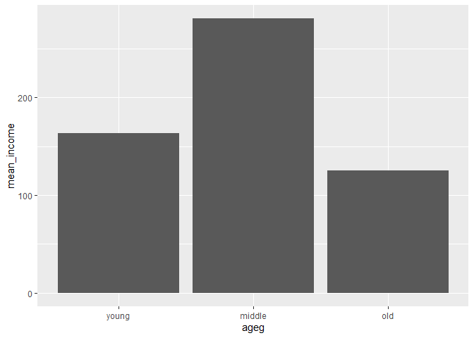

나이와 월급의 관계
================
정현진
July 31, 2020

## 4\. 연령대에 따른 월급 차이

나이를 연령대로 분류해서 비교

### 분석 절차

변수 검토 및 전처리 -\> 변수 간 관계 분석 연령대 연령대별 월급 평균표 만들기 월급 그래프

### 연령대 변수 검토 및 전처리하기

#### 1\. 파생변수 만들기 - 연령대

30세 미만 초년/ 30-59세 이하 중년/ 60세 이상 노년

``` r
welfare <- welfare %>% 
  mutate(ageg = ifelse(age < 30, "young", ifelse(age <= 59, "middle", "old")))
table(welfare$ageg)
qplot(welfare$ageg)
```

<!-- -->

### 연령대에 따른 월급 차이 분석하기

#### 1\. 연령대별 월급 평균표 만들기

월급의 결측값을 제거하고 나이별로 묶어주고 평균 구한다

``` r
ageg_income <- welfare %>% 
  filter(!is.na(income)) %>% 
  group_by(ageg) %>% 
  summarise(mean_income = mean(income))
```

    ## `summarise()` ungrouping output (override with `.groups` argument)

``` r
ageg_income
```

    ## # A tibble: 3 x 2
    ##   ageg   mean_income
    ##   <chr>        <dbl>
    ## 1 middle        281.
    ## 2 old           125.
    ## 3 young         164.

#### 2\. 그래프 만들기

#### 막대 정렬 : 초년, 중년, 노년 나이 순

``` r
ggplot(data= ageg_income, aes(x =ageg, y=mean_income)) + geom_col() + scale_x_discrete(limits = c("young", "middle", "old"))
```

<!-- -->
