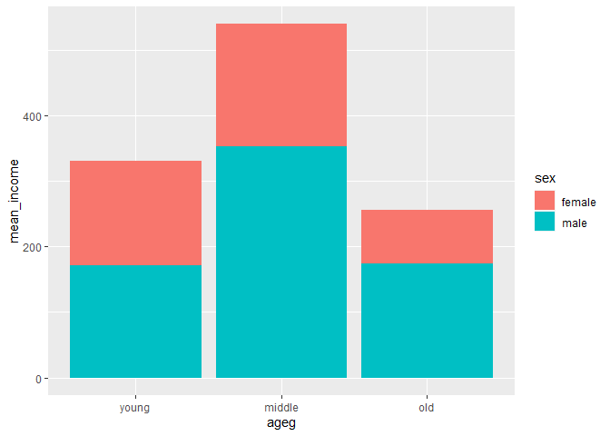
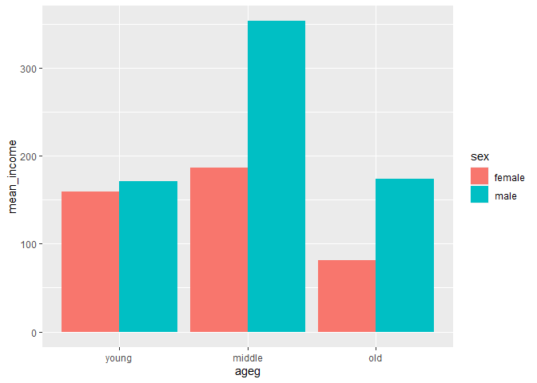

연령대 및 성별 월급차이
================
정현진
July 31, 2020

## 5\. 연령대 및 성별 월급 차이

성별 월급 차이는 연령대별로 다를까?

### 분석 절차

변수 검토 및 전처리 -\> 변수 간 관계 분석 연령대 연령대 및 성별 월급 평균표 만들기 성별 그래프 만들기 월급

### 연령대 및 성별 월급 차이 분석하기

#### 1\. 연령대 및 성별 월급 평균표 만들기

``` r
sex_income <- welfare %>% 
  filter(!is.na(income)) %>% 
  group_by(ageg, sex) %>% 
  summarise(mean_income = mean(income))
```

    ## `summarise()` regrouping output by 'ageg' (override with `.groups` argument)

``` r
sex_income
```

#### 2\. 그래프 만들기

연령대별 및 성별 = x축이 ageg, 성별로 다른색으로 표현 fill scle

``` r
ggplot(data = sex_income, aes(x= ageg, y = mean_income, fill = sex)) + geom_col() + scale_x_discrete(limits = c("young", "middle", "old"))
```

<!-- --> \#\#\#\#
성별 막대 분리

``` r
ggplot(data = sex_income, aes(x=ageg, y= mean_income, fill = sex)) + geom_col(position= "dodge") +
scale_x_discrete(limits = c("young", "middle", "old"))
```

<!-- -->

### 나이 및 성별 월급 차이 분석하기

#### 그래프 만들기

``` r
sex_age <- welfare %>% 
  filter(!is.na(income)) %>% 
  group_by(age, sex) %>% 
  summarise(mean_income = mean(income))
```

    ## `summarise()` regrouping output by 'age' (override with `.groups` argument)

``` r
ggplot(data = sex_age, aes(x= age, y = mean_income, col = sex)) + geom_line()
```

<!-- -->
