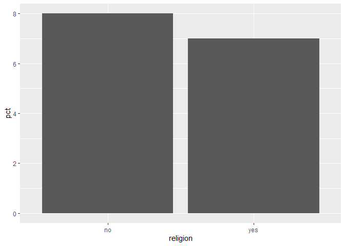
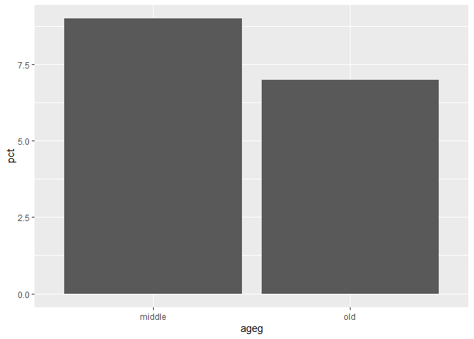
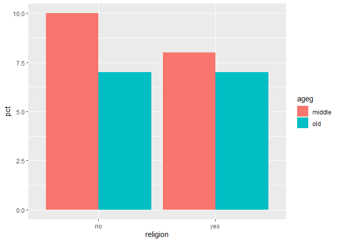

종교가 있으면 이혼을 덜 할까?
================
정현진
August 1, 2020

## 8\. 종교 유무에 따른 이혼율

### 분석 절차

변수 검토 및 전처리 -종교 -혼인 상태

변수 간 관계 분석 - 종교 유무에 따른 이혼율 표 만들기 - 그래프 만들기

### 종교 변수 검토 및 전처리하기

#### 1\. 변수 검토하기

``` r
class(welfare$religion)
table(welfare$religion)
```

#### 2\. 전처리

1-있음 2-없음 다른 값이 존재하지 않으니, 이상치 결측 처리 작업은 생략 값의 의미를 이해할 수 있도록 종교 유뮤에 따른 문자
부여

``` r
#종교 유무 이름 부여
welfare$religion <- ifelse(welfare$religion == 1, "yes" , "no")
table(welfare$religion)
qplot(welfare$religion)
```

<!-- -->

### 혼인 상태 변수 검토 및 전처리하기

#### 1\. 변수 검토하기

``` r
class(welfare$marriage)
table(welfare$marriage)
```

#### 2\. 전처리

0- 비해당(18세 미만), 1- 유배우, 2- 사별, 3- 이혼, 4- 별거, 5- 미혼(18세 이상, 미혼모 포함), 6-
기타(사망 등) 다른 변수는 필요 없고 1,3만 필요하므로 새 변수 만들기

``` r
#이혼 여부 변수 만들기
welfare$group_marriage <- ifelse(welfare$marriage == 1, "marriage",
                          ifelse(welfare$marriage == 3, "divorce", NA))
table(welfare$group_marriage)
```

    ## 
    ##  divorce marriage 
    ##      712     8431

``` r
qplot(welfare$group_marriage)
```

<!-- --> 결측치 7521명은
분석에 제외할 필요 O

### 종교 유무에 따른 이혼율 분석하기

#### 1\. 종교 유무에 따른 이혼율 표 만들기

종교 유무 및 결혼 상태별로 나눠 빈도를 구한 뒤 각 종교 유무 집단의 전체 빈도로 나눠 비율을 구한다 round()함수 이용해,
소수점 첫째 자리까지 표현

``` r
religion_marriage <- welfare %>% 
                     filter(!is.na(group_marriage)) %>% 
                     group_by(religion, group_marriage) %>% 
                     summarise(n = n()) %>% 
                     mutate(tot_group = sum(n)) %>% 
                     mutate(pct = round(n/tot_group*100,1))
```

    ## `summarise()` regrouping output by 'religion' (override with `.groups` argument)

``` r
religion_marriage
```

#### `count()` 활용

``` r
religion_marriage <- welfare %>%
                     filter(!is.na(group_marriage)) %>% 
                     count(religion, group_marriage) %>% 
                     group_by(religion) %>% 
                     mutate(pct = round(n/sum(n)*100))

religion_marriage
```

#### 2\. 이혼율 표 만들기

``` r
#이혼 추출
divorce <- religion_marriage %>% 
           filter(group_marriage == "divorce") %>% 
           select(religion, pct)

divorce
```

#### 3\. 그래프 만들기

``` r
ggplot(data = divorce, aes(x= religion, y= pct)) + geom_col()
```

<!-- -->

### 연령대 및 종교 유무에 따른 이혼율 분석하기

앞에선 전체 대상으로 종교 유무에 따른 이혼율 분석

#### 1\. 연령대별 이혼율 표 만들기

``` r
ageg_marriage <- welfare %>% 
                 filter(!is.na(group_marriage)) %>% 
                 group_by(ageg, group_marriage) %>% 
                 summarise(n = n()) %>% 
                 mutate(tot_group = sum(n)) %>% 
                 mutate(pct = round(n/tot_group*100))
```

    ## `summarise()` regrouping output by 'ageg' (override with `.groups` argument)

``` r
ageg_marriage
```

#### `count()` 활용

``` r
ageg_marriage <- welfare %>% 
                 filter(!is.na(group_marriage)) %>% 
                 count(ageg, group_marriage) %>% 
                 group_by(ageg) %>% 
                 mutate(pct = round(n/sum(n)*100))
ageg_marriage
```

#### 2\. 연령대별 이혼율 그래프 만들기

young 그룹은 사례가 적어 분석에서 제외

``` r
#초년 제외, 이혼 추출
ageg_divorce <- ageg_marriage %>% 
                filter( ageg != "young" & group_marriage == "divorce") %>% 
                select(ageg, pct)
ageg_divorce
```

    ## # A tibble: 2 x 2
    ## # Groups:   ageg [2]
    ##   ageg     pct
    ##   <chr>  <dbl>
    ## 1 middle     9
    ## 2 old        7

``` r
ggplot(data = ageg_divorce, aes(x= ageg, y= pct)) + geom_col()
```

<!-- -->

#### 3\. 연령대 및 종교 유무에 따른 이혼율 표 만들기

종교 유무에 따른 이혼율 차이가 연령대별로 다를까? 연령대, 종교 유무, 결혼 상태별로 집단을 나눠 빈도를 구한 뒤, 각 집단
전체 빈도로 나눠 비율을 구한다 이혼에 해당하는 값만 추출해 연령대 및 종교 유무별 이혼율 표 만들기

``` r
ageg_religion_marriage <- welfare %>% 
                          filter(!is.na(group_marriage) & ageg != "young")                            %>% group_by(ageg, religion, group_marriage) %>% 
                          summarise(n = n()) %>% 
                          mutate(tot_group = sum(n)) %>% 
                          mutate(pct = n/tot_group*100)
```

    ## `summarise()` regrouping output by 'ageg', 'religion' (override with `.groups` argument)

``` r
ageg_religion_marriage
```

#### `count()` 활용

``` r
ageg_religion_marriage <- welfare %>% 
                          filter(!is.na(group_marriage) & ageg != "young")                            %>% count(ageg, religion, group_marriage) %>% 
                          group_by(ageg, religion) %>%  
                          mutate(pct = round(n/sum(n)*100))
ageg_religion_marriage
```

#### 연령대 및 종교 유무별 이혼율 표 만들기

``` r
df_divorce <- ageg_religion_marriage %>% 
              filter(group_marriage == "divorce") %>% 
              select(ageg, religion, pct)
df_divorce
```

#### 4\. 연령대 및 종교 유무에 따른 이혼율 그래프 만들기

``` r
ggplot(data = df_divorce, aes(x= religion, y = pct, fill = ageg)) + geom_col(position = "dodge")
```

<!-- -->
