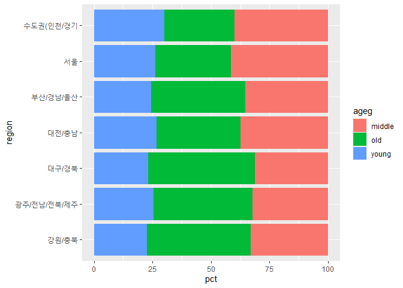
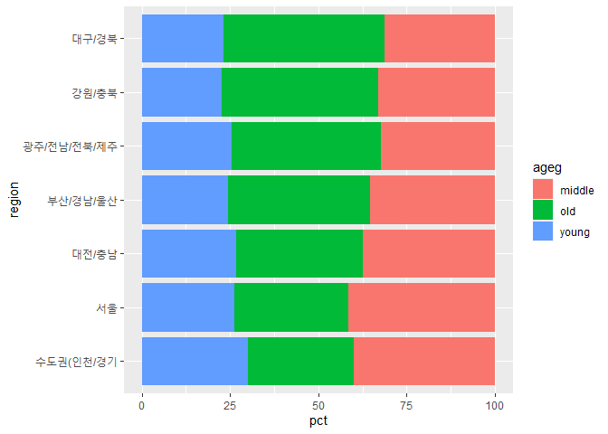
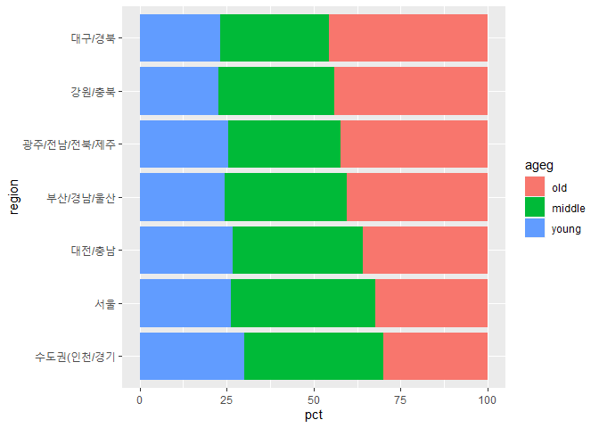

지역별 연령대 비율- 노년층이 많은 지역은?
================
정현진
August 1, 2020

## 9\. 지역별 연령대 비율

### 분석 절차

변수 검토 및 전처리 - 지역 - 연령대

변수 간 관계 분석 - 지역별 연령대 비율표 만들기 - 그래프 만들기

### 지역 변수 검토 및 전처리하기

#### 1\. 변수 검토하기

``` r
class(welfare$code_region)
table(welfare$code_region)
```

#### 2\. 전처리

code\_region변수희 7개 값은 권역을 의미하는 지역 코드 1- 서울, 2- 수도권, 3- 부산.경남,울산, 4-
대구,경북, 5- 대전, 충남, 6- 강원 충북, 7- 광주, 전남, 전북, 제주 지역코드 목록을 만들고,
welfare에 들어 있는 code\_region 변수를 이용해 welfare에 지역명 변수 추가 예정(left\_join)

``` r
#지역 코드 목록 만들기
list_region <- data.frame(code_region = c(1:7), region = c("서울", "수도권(인천/경기", "부산/경남/울산", "대구/경북" , "대전/충남", "강원/충북", "광주/전남/전북/제주"))
list_region

#지역명 변수 추가
welfare <- left_join(welfare, list_region, id= "code_region")
```

    ## Joining, by = "code_region"

``` r
##Joiningm by = "code_region"

welfare %>% 
  select(code_region, region) %>% 
  head
```

### 지역별 연령대 비율 분석하기

연령대 변수 전처리는 앞에서 했으니 생략

#### 1\. 지역별 연령대 비율표 만들기

지역 및 연령대별로 나눠 빈도를 구하고 각 지역의 전체 빈도로 나눠 비율 구한다

``` r
region_ageg <- welfare %>% 
               group_by(region, ageg) %>% 
               summarise(n = n()) %>% 
               mutate(tot_group = sum(n)) %>% 
               mutate(pct = round(n/tot_group*100), 2)
```

    ## `summarise()` regrouping output by 'region' (override with `.groups` argument)

``` r
head(region_ageg)
```

#### `count()` 활용

``` r
region_ageg <- welfare %>% 
               count(region, ageg) %>% 
               group_by(region) %>% 
               mutate(pct = round(n/sum(n)*100,2))
```

#### 2\. 그래프 만들기

연령대 비율 막대를 서로 다른 색으로 표현하기 위해 aes의 fill 파라미터를 ageg 지정, coord\_flipdmf 추가해
지역별로 비교하기 쉽게 해줌

``` r
ggplot(data = region_ageg, aes(x = region, y = pct, fill = ageg)) + geom_col() + coord_flip()
```

<!-- -->

#### 3\. 막대 정렬하기 : 노년층 비율 높은 순

위의 그래프는 지역명 가나다 순으로 정렬되어 있음, 정렬을 노년층 비율이 높은 순으로 재정렬(노년층 비율 순으로 표 정렬 후,
지역명 추출해 변수 만들기)

``` r
#노년층 비율 내림차순 정렬
list_order_old <- region_ageg %>% 
                  filter(ageg == "old") %>% 
                  arrange(pct)
list_order_old
```

    ## # A tibble: 7 x 4
    ## # Groups:   region [7]
    ##   region              ageg      n   pct
    ##   <chr>               <chr> <int> <dbl>
    ## 1 수도권(인천/경기    old    1109  29.9
    ## 2 서울                old     805  32.4
    ## 3 대전/충남           old     527  35.9
    ## 4 부산/경남/울산      old    1124  40.4
    ## 5 광주/전남/전북/제주 old    1233  42.2
    ## 6 강원/충북           old     555  44.2
    ## 7 대구/경북           old     928  45.6

``` r
#지역명 순서 변수 만들기
order <- list_order_old$region
order
```

    ## [1] "수도권(인천/경기"    "서울"                "대전/충남"          
    ## [4] "부산/경남/울산"      "광주/전남/전북/제주" "강원/충북"          
    ## [7] "대구/경북"

``` r
#그래프 만들기
#지역명이 노년층 비율 순으로 정렬된 order변수를 활용

ggplot(data = region_ageg, aes(x = region, y = pct, fill = ageg)) + geom_col() + coord_flip() + scale_x_discrete(limits = order)
```

<!-- -->

#### 4\. 연령대 순으로 막대 색깔 나열하기

young, old, middle 순으로 나열된 것을- 노년, 중년, 초년 연령대 순으로 나열 fill파라미터에 지정할 범주
순서를 지정 ageg 변수는 character 타입이라 levels가 없음

``` r
class(region_ageg$ageg)
```

    ## [1] "character"

``` r
levels(region_ageg$ageg)
```

    ## NULL

``` r
#factor를 이용해 ageg변수를 factor 타입으로 변환, level 파라미터를 이용해 순서 지정
region_ageg$ageg <- factor(region_ageg$ageg, level = c("old", "middle" ,   "young"))
class(region_ageg$ageg)
```

    ## [1] "factor"

``` r
levels(region_ageg$ageg)
```

    ## [1] "old"    "middle" "young"

``` r
#막대 색깔이 연령대 순으로 다시 나열
ggplot(data = region_ageg, aes(x = region, y = pct, fill = ageg)) + geom_col() + coord_flip() + scale_x_discrete(limits= order)
```

<!-- -->
