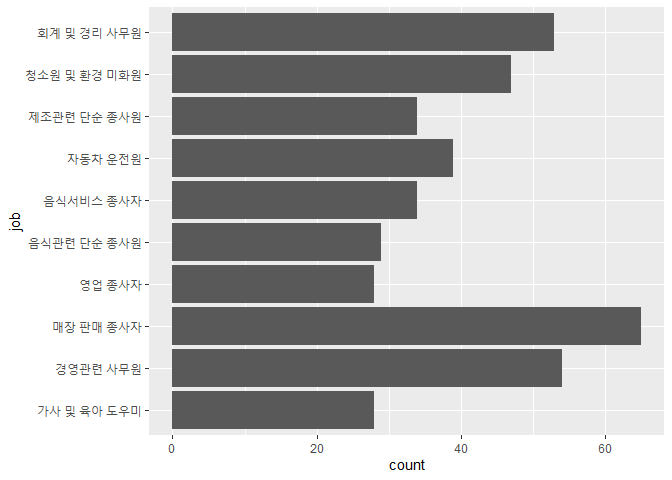
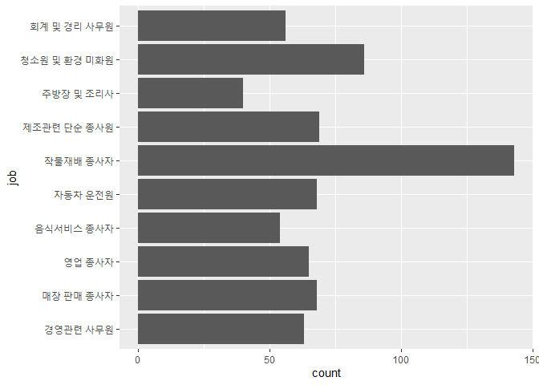
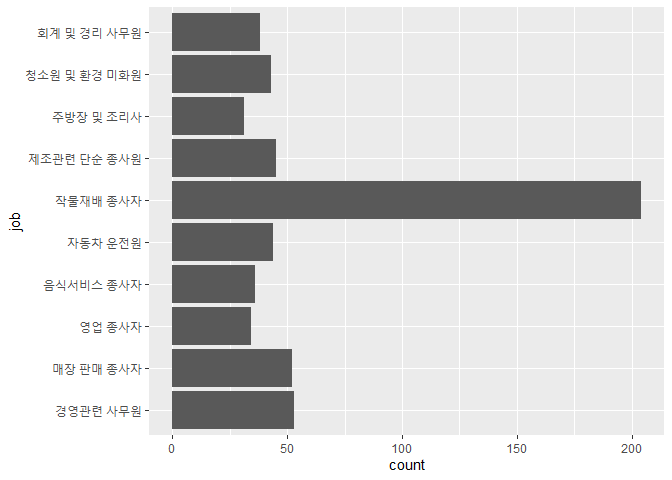
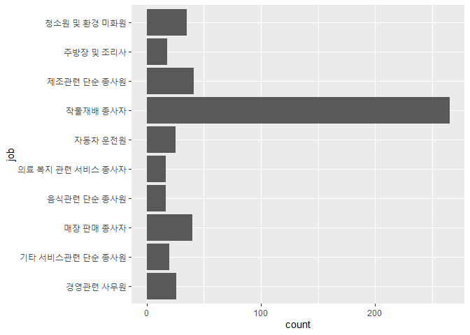
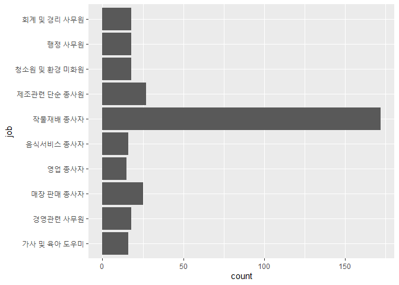
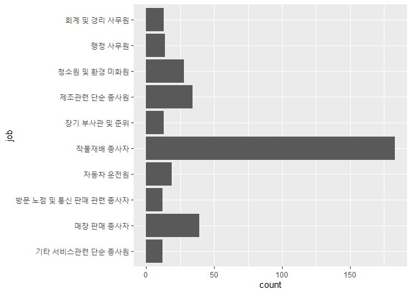
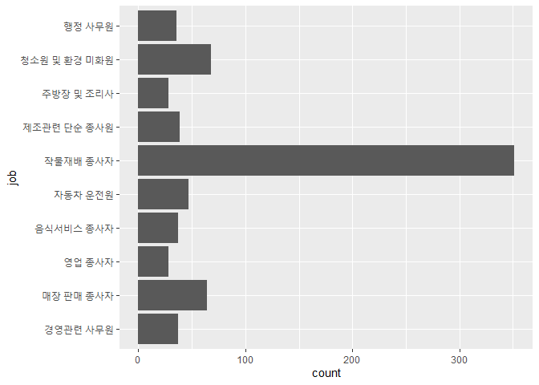

지역별 가장 많은 직업은?
================
정현진
August 5, 2020

앞에서 어떤 직업이 월급을 가장 많이 받는지 알아봤다면, 어떤 지역에 어떤 직업이 가장 많은지 알아보겠습니다.

### 분석 절차

변수 검토 및 전처리 - 지역 - 직업

변수 간 관계 분석 - 지역별 빈도표 만들기

### 지역과 직업 변수 검토 및 전처리하기

#### 1\. 지역 변수 검토하기

``` r
class(welfare$code_region)
table(welfare$code_region)
```

#### 1-1. 지역 변수 전처리

code\_region 변수의 값은 7개 권역을 의미하는 지역코드입니다. 1- 서울, 2- 수도권(인천/경기), 3-
부산/경남/울산 4- 대구/경북, 5- 대전/충남, 6- 강원/충북, 7- 광주/전남/전북/제주도

지역 코드 목록을 만들고, welfare에 동시에 들어있는 code\_region 변수를 이용해 welfare에 지역명 변수 추가

``` r
#지역 코드 목록 만들기
list_region <- data.frame(code_region = c(1:7), 
region = c("서울", 
"수도권(인천/경기)",
"부산/경남/울산", 
"대구/경북",
"대전/충남",
"강원/충북",
"광주/전남/전북/제주도"))

list_region

#지역명 변수 추가
welfare <- left_join(welfare, list_region, id = "code_region")
```

    ## Joining, by = "code_region"

``` r
##Joining, by = "code_region"

welfare %>% 
  select(code_region, region) %>% 
  head
```

#### 2\. 직업 변수 검토하기

``` r
class(welfare$code_job)
str(welfare$code_job)
```

code\_job변수는 직업코드를 의미합니다. 코드별로 어떤 직업을 의미하는지 알기 위해서 직업분류 코드를 이용해 직업 명칭
변수를 만들어 줍니다.

#### 2-1. 직업 변수 전처리하기

직업분류코드 목록 엑셀 문서를 readxl로 열고(\*주의: 문서 첫행을 변수명으로 갖고 오기. 필요한 자료는 문서의 2번째
시트) 직업분류코드 목록 데이터 프레임을 만들어 줍니다.

``` r
list_job <- read_excel("Koweps_Codebook.xlsx", col_names = T, sheet = 2)
str(list_job)
```

    ## tibble [149 x 2] (S3: tbl_df/tbl/data.frame)
    ##  $ code_job: num [1:149] 111 112 120 131 132 133 134 135 139 141 ...
    ##  $ job     : chr [1:149] "의회의원 고위공무원 및 공공단체임원" "기업고위임원" "행정 및 경영지원 관리자" "연구 교육 및 법률 관련 관리자" ...

변수는 직업코드와 직업명, 총 149개의 직업으로 분류되어 있습니다 이제 list\_job변수를 welfare에 결합시켜
줍니다(left\_join활용) 지역명 변수를 결합시켰던 것처럼, 동일하게 들어있는 code\_job 기준으로 결합시켜
줍니다.

``` r
welfare <- left_join(welfare, list_job, id = "code_job")
```

    ## Joining, by = "code_job"

``` r
##Joining, by = "code_job"

welfare %>% 
  filter(!is.na(code_job)) %>% 
  select(code_job, job) %>% 
  head(10)
```

welfare데이터 프레임에 code\_job 기준으로 job 변수가 결합되었습니다

### 변수간 관계 분석

#### 3-1. count함수 활용

지역별로 동일한 직업을 갖고 있는 사람들이 몇명인지 알아보겠습니다

``` r
region_job <- welfare %>% 
  group_by(region, job) %>% 
  filter(!is.na(job)) %>% 
  summarise(count=n())
```

    ## `summarise()` regrouping output by 'region' (override with `.groups` argument)

``` r
head(region_job)
```

직업이 너무 많아서 지역별로 추출할 필요가 있습니다.

#### 3-2. 지역별 추출 후 빈도표 만들기

직업이 가나다순으로 정렬되어 있으므로 가장 많은 직업을 갖고있는 10가지 정렬해 줍니다.

``` r
seoul_job_top10 <- region_job %>% filter(region == "서울") %>% 
  arrange(desc(count)) %>% head(10)
ggplot(seoul_job_top10, aes(x= job, y= count)) +
  geom_col()+ coord_flip()
```

<!-- -->

``` r
ingyeong_job_top10 <- region_job %>% 
  filter(region == "수도권(인천/경기)")%>% 
  arrange(desc(count)) %>% head(10)

ggplot(ingyeong_job_top10, aes(x= job, y= count)) +
  geom_col()+ coord_flip()
```

<!-- -->

``` r
gyeongnam_job_top10 <- region_job %>% filter(region == "부산/경남/울산")%>% 
  arrange(desc(count)) %>% head(10)
ggplot(gyeongnam_job_top10, aes(x= job, y= count)) +
  geom_col()+ coord_flip()
```

<!-- -->

``` r
gyeongbuk_job_top10 <- region_job %>% filter(region == "대구/경북")%>% 
  arrange(desc(count)) %>% head(10)
ggplot(gyeongbuk_job_top10, aes(x= job, y= count)) +
  geom_col()+ coord_flip()
```

<!-- -->

``` r
chungnam_job_top10 <- region_job %>% filter(region == "대전/충남")%>% 
  arrange(desc(count)) %>% head(10)
ggplot(chungnam_job_top10, aes(x= job, y= count)) +
  geom_col()+ coord_flip()
```

<!-- -->

``` r
chungbuk_job_top10 <- region_job %>% filter(region == "강원/충북")%>% 
  arrange(desc(count)) %>% head(10)
ggplot(chungbuk_job_top10, aes(x= job, y= count)) +
  geom_col()+ coord_flip()
```

<!-- -->

``` r
jeonnam_job_top10 <- region_job %>% 
  filter(region == "광주/전남/전북/제주도")%>% 
  arrange(desc(count)) %>% head(10)
ggplot(jeonnam_job_top10, aes(x= job, y= count)) +
  geom_col()+ coord_flip()
```

<!-- -->

### 4\. 분석 결론

서울 지역에 가장 많은 직업은 매장 판매 종사자였고, 나머지 지역엔 작물재배 종사자가 많은 걸 알 수 있었습니다.
